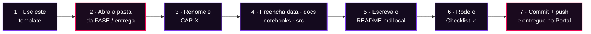
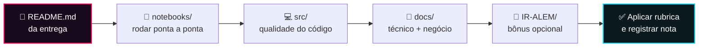

<!-- ╔══════════════════════════════════════════════════════════════════════════╗
     ║  FIAP · PORTFÓLIO OFICIAL — GRADUAÇÃO ON EM INTELIGÊNCIA ARTIFICIAL       ║
     ║  Template institucional · README (home page do repositório)              ║
     ╚══════════════════════════════════════════════════════════════════════════╝ -->

<div align="center">

<a href="https://www.fiap.com.br/graduacao/tecnologo/inteligencia-artificial/">
  
</a>

<br /><br />


<h1>Portfólio Oficial · Inteligência Artificial</h1>

<h3>Graduação ON · Tecnólogo em Inteligência Artificial · <code>TIA ON</code></h3>

<p><em>Machine Learning · IA Generativa · Natural Language Processing</em></p>

<p>
  
  
  
  
</p>

<p>
  
  
  
  
</p>

<b>🚀 Este é o template padrão que acompanha você do primeiro ao último dia do curso.</b><br />
Um só padrão. Toda entrega. Os dois anos inteiros. Do jeito que o mercado espera de você.

</div>

<br />

<div align="center">

**⚡ Comece por aqui — escolha o seu caminho:**

| Se você é… | Vá direto para |
| :-- | :-- |
| 🎓 **Aluno(a) começando agora** | <a href="#nav-comecar">Como usar o template</a> → <a href="#nav-pastas">O que cada pasta significa</a> → <a href="#nav-checklist">Checklist de entrega</a> |
| 🧑‍🏫 **Tutor(a) / Professor(a)** | <a href="#nav-tutores">Guia de correção</a> → <a href="#nav-rubrica">Rubrica de qualidade</a> |
| 🧠 **Quer entender o método** | <a href="#nav-metodologia">Metodologia FIAP</a> → <a href="#nav-curriculo">Matriz curricular</a> |

</div>

---

> [!IMPORTANT]
> Este é o **repositório-template oficial da FIAP** para a **Graduação ON em Inteligência Artificial**.
> Ele padroniza **todas** as entregas do curso — FASES, Enterprise Challenge, Global Solution e Startup One —
> ao longo dos **dois anos** (`1TIAO` e `2TIAO`). Use-o como esqueleto de cada projeto: **duplique, preencha, entregue.** ✨

<br />

## ⚡ O futuro não se espera. Se constrói.

> [!NOTE]
> Você não entrou em um curso. Você entrou em um **laboratório de futuros**.

A cada `commit` deste repositório, você deixa de ser espectador da revolução da Inteligência Artificial e passa a ser **autor** dela. Redes neurais, IA generativa, visão computacional, agentes autônomos — aqui não são temas de prova: são **ferramentas nas suas mãos**.

Este repositório é a **casa da sua obra**. É onde suas ideias viram artefatos, seus experimentos viram evidência e seus dois anos de graduação viram um **portfólio profissional** que fala por você antes mesmo de você dizer uma palavra.

Trate cada entrega como se o mundo fosse ver — porque um dia ele verá.

<div align="center">

**Bem-vindo à linha de frente. Bem-vindo à FIAP.** 🧠⚡

</div>

---

## 🎓 Sobre a graduação

A **Graduação ON em Inteligência Artificial** (`TIA ON`) é o tecnólogo **100% online** da **FIAP** — a maior faculdade de tecnologia do Brasil. Em **2 anos**, forma profissionais capazes de **projetar, treinar e colocar em produção** sistemas inteligentes de ponta a ponta.

O aprendizado é **hands-on desde o primeiro dia**: a proposta é *transformar a sala de aula em um laboratório de futuros*, onde cada disciplina termina em uma entrega **real, versionada e apresentável**. Este repositório é o instrumento que dá **forma, rigor e consistência** a essa jornada.

<div align="center">

| 🎯 O que você domina | ⚙️ Como você aprende | 🏆 O que você prova |
| :-- | :-- | :-- |
| Machine Learning & Deep Learning | Challenge Based Learning | MEC **Nota 5** (máxima) |
| IA Generativa & LLMs | Projetos reais desde o início | **95%** de empregabilidade |
| NLP, Visão Computacional & Robótica | Desafios de grandes empresas | **+3.000** organizações parceiras |
| IA aplicada a negócios & governança | Avaliação semestral integradora | **4** certificações profissionais |

</div>

---

<a id="nav-metodologia"></a>

## 🧬 Metodologia FIAP — os formatos das suas entregas

Na FIAP você **aprende fazendo**. Cada formato de entrega tem um propósito — e um lugar próprio dentro deste template.

```mermaid
flowchart LR
    A(["🎓 Ingresso · TIA ON"]) --> B
    subgraph ANO1["🟣 1º ANO · 1TIAO"]
        direction TB
        B["📚 FASES 1–7"] --> C["🏢 Enterprise Challenge"]
        C --> D["🌍 Global Solution 1 · 2"]
    end
    D --> E
    subgraph ANO2["🔵 2º ANO · 2TIAO"]
        direction TB
        E["📚 FASES 1–7"] --> F["🏢 Enterprise Challenge"]
        F --> G["🌍 Global Solution 1 · 2"]
    end
    G --> H(["🚀 Startup One"])
    H --> I(["💼 95% empregabilidade"])
    classDef fase fill:#1a0a1e,stroke:#ED0A55,stroke-width:2px,color:#fff;
    classDef ent fill:#0a1420,stroke:#22D3EE,stroke-width:2px,color:#fff;
    classDef gs fill:#140a20,stroke:#A855F7,stroke-width:2px,color:#fff;
    classDef ms fill:#07070D,stroke:#FF2E7E,stroke-width:2px,color:#fff;
    class B,E fase;
    class C,F ent;
    class D,G gs;
    class A,H,I ms;
```



<div align="center">

| Formato | 🎯 O que é | 📁 Onde vive no template |
| :-- | :-- | :-- |
| 📚 **FASES** | Capítulos/atividades entregues por disciplina ao longo do semestre. | `FASE1 … FASE7/CAP-X-.../` |
| 🏢 **Enterprise Challenge** | Desafio real proposto por uma grande empresa parceira. | `ENTERPRISE-CHALLENGE/` |
| 🌍 **Global Solution** | Avaliação **semestral** que integra as disciplinas resolvendo uma grande questão do mundo real. | `GLOBAL-SOLUTION-1/` · `GLOBAL-SOLUTION-2/` |
| 🚀 **Startup One** | Projeto final: você constrói e apresenta sua solução como uma **startup**. | Consolida todo o portfólio |
| 🔭 **Future Makers** | Iniciação científica — pesquisa aplicada em IA. | Trilha complementar (`docs/` · `IR-ALEM/`) |

</div>

> [!NOTE]
> A **Global Solution** é o marco semestral do curso: ela conecta tudo o que você viu em todas as disciplinas em um único projeto de impacto. É onde o portfólio realmente **brilha** — trate-a como sua vitrine. 🌍✨

---

<a id="nav-comecar"></a>

## 🧭 Como usar este template

O fluxo é **sempre o mesmo** — em qualquer disciplina, qualquer fase, qualquer ano. Aprenda uma vez, repita para sempre.



<details open>
<summary><b>📖 Passo a passo detalhado (clique para expandir/recolher)</b></summary>

<br />

**1 · Duplique o template (use como base)**
Clique em **`Use this template`** no topo do repositório para criar o seu próprio repositório a partir desta estrutura — ou clone diretamente:

```bash
git clone https://github.com/fiap-tutoria/FIAP-PORTFOLIO-AI.git
cd FIAP-PORTFOLIO-AI
```

**2 · Encontre a pasta da sua entrega**
Navegue até o **ano** → a **fase/desafio** correspondente à atividade pedida no Portal:

```text
1TIAO/   ← 1º ano        2TIAO/   ← 2º ano
  ├── FASE1 … FASE7            ← capítulos/atividades por disciplina
  ├── ENTERPRISE-CHALLENGE     ← desafio de grande empresa
  ├── GLOBAL-SOLUTION-1        ← avaliação semestral (1º sem.)
  └── GLOBAL-SOLUTION-2        ← avaliação semestral (2º sem.)
```

**3 · Renomeie a pasta `CAP-X-...`**
Dentro de cada `FASE` há uma pasta-modelo `CAP-X-NOME-DA-ATIVIDADE-APRESENTADA-NO-PORTAL/`. Renomeie-a **exatamente com o nome da atividade que aparece no Portal**, trocando o `X` pelo número do capítulo:

```text
✅ CAP-3-ANALISE-EXPLORATORIA-DE-SENSORES-AGRICOLAS
✅ CAP-1-CLASSIFICADOR-DE-IMAGENS-COM-CNN
❌ atividade_final (2)      ← evite nomes genéricos
```

> Uma fase pode conter **mais de um** `CAP-...`. Duplique a pasta-modelo quantas vezes precisar, uma por capítulo.

**4 · Preencha as pastas-padrão**
Datasets em `data/` · documentação em `docs/` · notebooks em `notebooks/` · código em `src/`. Conteúdo opcional avançado vai em `IR-ALEM/`. Veja o significado de cada uma em <a href="#nav-pastas">O que cada pasta significa</a>.

**5 · Documente o `README.md` da entrega**
É a **porta de entrada** que o tutor lê primeiro. Deve responder, no mínimo: **O quê?** (objetivo), **Como rodar?** (execução e dependências), **O que foi feito?** (abordagem e resultados) e **Quem?** (nome, RM e turma).

**6 · Rode o Checklist**
Passe pelo <a href="#nav-checklist">Checklist de entrega</a> — é o mesmo que o tutor usa para corrigir.

**7 · Versione e entregue**
```bash
git add .
git commit -m "feat(fase3): CAP-3 análise exploratória de sensores"
git push
```
Confirme que o link do repositório abre (público ou compartilhado com a tutoria) e submeta no Portal FIAP.

</details>

<details>
<summary><b>🏷️ Convenções de nomenclatura & commits</b></summary>

<br />

| Elemento | Convenção | Exemplo |
| :-- | :-- | :-- |
| Pasta de atividade | `CAP-<n>-<NOME-EM-CAIXA-ALTA>` | `CAP-3-CLASSIFICADOR-DE-IMAGENS` |
| Notebooks | `nome_descritivo.ipynb` (snake_case) | `analise_exploratoria.ipynb` |
| Código-fonte | dentro de `src/`, modular | `src/model.py`, `src/utils.py` |
| Commits | *Conventional Commits* | `feat(fase2): treino do modelo baseline` |
| Módulo opcional | isolado em `IR-ALEM/` | `IR-ALEM/` dentro da pasta da atividade |

</details>

> [!TIP]
> **Regra de ouro:** se um tutor abrir sua pasta e não entender em **30 segundos** o que você fez e como rodar, o `README.md` da entrega precisa de mais amor. Documentação é parte da nota — e da vida profissional. 💼

---

<a id="nav-pastas"></a>

## 🗂️ O que cada pasta significa

Este é o **contrato visual** do template: todo tutor sabe exatamente onde procurar cada coisa — e você sabe exatamente onde colocar.

<div align="center">

| Pasta | Para que serve | O que colocar aqui |
| :-- | :-- | :-- |
| 📊 **`data/`** | Datasets | Bases brutas e tratadas, dicionário de dados, amostras. Arquivos pesados → link + instruções de download. |
| 📄 **`docs/`** | Documentação técnica **e** de negócio | Relatórios, diagramas de arquitetura, modelagem, justificativas, referências, vídeo-pitch. |
| 📓 **`notebooks/`** | Exploração e experimentação | Jupyter / Google Colab (`.ipynb`) com EDA, treino, avaliação — **executáveis de ponta a ponta**. |
| 💻 **`src/`** | Código-fonte | Scripts e módulos (`.py`, `.R`, `.cpp`, `.js`), pipelines, APIs, firmware (ESP32/Arduino), apps Streamlit. |
| 🌌 **`IR-ALEM/`** | Módulo opcional **"Ir Além"** | Extensões e desafios avançados **isolados** do escopo obrigatório. Ganha pontos, não atrapalha a nota base. |
| 📘 **`README.md`** | Capa da entrega | Objetivo, como rodar, decisões técnicas e autoria. É o **primeiro** arquivo que o tutor abre. |

</div>

> [!TIP]
> Se um arquivo não tem uma pasta óbvia, ele provavelmente vai em `docs/`. **Nunca** deixe arquivos soltos na raiz de um `CAP-...`.

<details>
<summary><b>🧱 Ver a árvore completa do repositório</b></summary>

<br />

```text
FIAP-PORTFOLIO-AI/
├── assets/                         # 🎨 logo-fiap.png · hero.svg
├── README.md                       # 🏠 você está aqui (home page)
│
├── 1TIAO/                          # 🟣 1º ANO
│   ├── FASE1/ … FASE7/             #    capítulos/atividades por disciplina
│   │   └── CAP-X-NOME-DA-ATIVIDADE-APRESENTADA-NO-PORTAL/
│   │       ├── data/               #    📊 datasets
│   │       ├── docs/               #    📄 documentação técnica e de negócio
│   │       ├── notebooks/          #    📓 Jupyter / Google Colab
│   │       ├── src/                #    💻 código-fonte
│   │       ├── IR-ALEM/            #    🌌 módulo opcional "Ir Além" (isolado)
│   │       └── README.md
│   │
│   ├── ENTERPRISE-CHALLENGE/       # 🏢 desafio de grande empresa
│   │   └── data/ · docs/ · notebooks/ · src/ · README.md
│   │
│   ├── GLOBAL-SOLUTION-1/          # 🌍 avaliação semestral (1º sem.)
│   └── GLOBAL-SOLUTION-2/          # 🌍 avaliação semestral (2º sem.)
│       └── data/ · docs/ · notebooks/ · src/ · README.md
│
└── 2TIAO/                          # 🔵 2º ANO — estrutura idêntica ao 1º
    ├── FASE1/ … FASE7/
    ├── ENTERPRISE-CHALLENGE/
    ├── GLOBAL-SOLUTION-1/
    └── GLOBAL-SOLUTION-2/
```

</details>

---

<a id="nav-checklist"></a>

## ✅ Checklist de entrega

Copie este bloco para o `README.md` da sua entrega e marque conforme avança. **O tutor corrige por ele.**

```markdown
### ✅ Checklist de entrega
- [ ] Pasta na FASE / desafio correto, dentro de 1TIAO/ ou 2TIAO/
- [ ] CAP-X-... renomeado com o nome real do capítulo do Portal
- [ ] Datasets em data/ (ou link de download documentado)
- [ ] Documentação técnica e de negócio em docs/
- [ ] Notebooks em notebooks/ executam de ponta a ponta, sem erro
- [ ] Código organizado em src/ (funções e módulos, sem células soltas)
- [ ] README.md preenchido: objetivo, como rodar, resultados, autoria
- [ ] Nome, RM e turma identificados
- [ ] Reprodutível: dependências e versões listadas (requirements.txt / ambiente)
- [ ] Fontes de dados citadas e sem informação sensível versionada
- [ ] (Opcional) Módulo IR-ALEM/ isolado, se você foi além
- [ ] Commit + push feitos e link validado no Portal
```

> [!NOTE]
> **Reprodutibilidade vale nota.** Se o tutor não consegue rodar, o tutor não consegue avaliar o mérito técnico. Documente ambiente, versões e passos.

---

<a id="nav-tutores"></a>

## 🧑‍🏫 Para tutores & professores

Este template foi desenhado para tornar a **correção rápida, justa e rastreável**. Como cada entrega segue exatamente o mesmo layout, o tutor sabe onde procurar cada coisa em **qualquer** trabalho, de qualquer aluno, em qualquer fase.



<div align="center">

| Você quer avaliar… | Abra… |
| :-- | :-- |
| Entendimento do problema e comunicação | `README.md` + `docs/` |
| Execução técnica e resultados | `notebooks/` (rode do início ao fim) |
| Qualidade e organização de código | `src/` |
| Fundamentação de negócio / impacto | `docs/` |
| Iniciativa e profundidade extra | `IR-ALEM/` (bônus) |

</div>

<a id="nav-rubrica"></a>

### 📐 Rubrica de qualidade (sugestão de avaliação)

Eixos para uma avaliação consistente entre turmas e disciplinas. Ajuste os pesos conforme a atividade.

<div align="center">

| Eixo | O que observar | Peso sugerido |
| :-- | :-- | :--: |
| 🎯 **Aderência ao enunciado** | Cumpre o que o Portal pediu; escopo completo | 25% |
| 🔬 **Corretude técnica** | Métodos adequados, resultados válidos, sem erros | 25% |
| 🔁 **Reprodutibilidade** | Roda do zero; dependências e dados documentados | 15% |
| 🧹 **Organização & padrão** | Pastas corretas, código limpo, arquivos no lugar | 15% |
| 📝 **Documentação & clareza** | README e docs explicam o quê, como e por quê | 15% |
| 🚀 **Ir Além (bônus)** | Profundidade extra em `IR-ALEM/` | +5% |

</div>

> [!NOTE]
> **Checklist de conformidade do template:** a pasta foi renomeada a partir de `CAP-X-...`? As pastas-padrão existem e estão preenchidas? O `README.md` local descreve a solução? Três "sim" garantem uma entrega padronizada e pronta para nota. ✅

---

<a id="nav-curriculo"></a>

## 📚 Matriz curricular

<table>
<tr>
<td valign="top" width="50%">

### 🟣 Ano 1 · `1TIAO` — a fundação

- 🎯 **IA Challenges**
- 🔌 **Computer Systems & Sensors**
- 🧬 **Cognitive Data Science**
- 🤖 **Machine Learning & Modelling**
- 🛡️ **Cognitive Cybersecurity**
- ☁️ **Plataformas, Serviços Cognitivos & Cloud Computing**
- 🧠 **Redes Neurais, Deep Learning & Algoritmos Genéticos**
- 🐍 **Computational Thinking with Python**
- 📈 **Statistical Computing with R & Python**
- 🌱 **Formação Social e Sustentabilidade**

</td>
<td valign="top" width="50%">

### 🔵 Ano 2 · `2TIAO` — a fronteira

- ✨ **Generative AI & Advanced Nets**
- 📱 **Front End & Mobile Development**
- 👁️ **Visão Computacional**
- 🦾 **Physical Computing, Embedded AI, Robotics & Cognitive IoT**
- ⚛️ **Computação Quântica & IA**
- 🖥️ **Cluster Computing, Neuromórfica & Supercomputadores**
- 💬 **NLP, Chatbots & Virtual Agents**
- ⚙️ **AI for Robotic Process Automation**
- 📊 **Governança em IA & Business Analytics**

</td>
</tr>
</table>

### 🎖️ Certificações profissionais — uma por semestre

<div align="center">


<br /><br />


</div>

---

## 🛠️ Stack tecnológica do curso

<div align="center">

**Linguagens**


**IA · Machine Learning · Data**


**Cloud & Plataformas**


**Edge · IoT · Visão**


</div>

---

## 🌟 Selos de qualidade

<div align="center">

| 🏅 MEC Nota 5 | 💼 95% de empregabilidade | 🤝 +3.000 parceiras |
| :--: | :--: | :--: |
| A nota **máxima** de avaliação | Via **Talent Lab** | Organizações que contratam nossos talentos |

</div>

---

## 🧭 Coordenação

<div align="center">

**Coordenador do curso**
### André Godoi Chiovato
<sub><a href="https://www.linkedin.com/in/andregodoichiovato/">Graduação ON em Inteligência Artificial · FIAP</a></sub>

</div>

---

## 📜 Licença

<div align="center">

Este template é distribuído sob a licença **Creative Commons Attribution 4.0 International (CC BY 4.0)**.
Você pode compartilhar e adaptar, inclusive para fins comerciais, **desde que atribua o devido crédito** à FIAP.

[](https://creativecommons.org/licenses/by/4.0/)

</div>

<p xmlns:cc="http://creativecommons.org/ns#" xmlns:dct="http://purl.org/dc/terms/"><a property="dct:title" rel="cc:attributionURL" href="https://github.com/fiap-tutoria/FIAP-PORTFOLIO-AI">TEMPLATE - FIAP PORTFÓLIO AI</a> por <a rel="cc:attributionURL dct:creator" property="cc:attributionName" href="https://fiap.com.br">FIAP</a> está licenciado sobre <a href="http://creativecommons.org/licenses/by/4.0/?ref=chooser-v1" target="_blank" rel="license noopener noreferrer">Attribution 4.0 International</a>.</p>

---

<div align="center">


<h3>Do código ao futuro. 🚀</h3>

<p><em>Da sala de aula ao laboratório de futuros.<br />
Do primeiro <code>import</code> à sua Startup One.<br />
Um padrão que acompanha você o curso inteiro.</em></p>

<sub>© FIAP · Graduação ON em Inteligência Artificial (<code>TIA ON</code>) · Template oficial de portfólio · CC BY 4.0</sub>

<br /><br />


</div>
